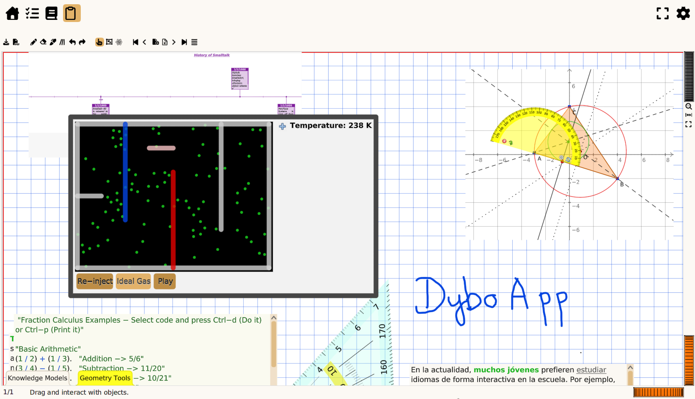

# Introduction

**DyboApp** (short for Dynamic Book Application) is an educational
software layer designed to streamline and enrich the teaching and
learning experience. Developed in Smalltalk and built to run on a
GNU/Linux system, it acts as a digital "cash register" for education —
optimizing daily tasks for teachers and students through
interconnected workflow management and interactive dynamic tools.

The app combines stylus-annotated PDF documents with pluggable
**dynamic knowledge models** (interactive tools) that can be easily
customized or retrieved from existing libraries, empowering users with
an agile, distraction-free environment for organizing and creating
study materials.

Check out our [short video
demonstrations](https://mamot.fr/deck/@drgeo/tagged/DyboAppDemo).

# Installation
For a quick test, [download a
bundle](https://github.com/Dynamic-Book/DyboApp/releases) from the
relase page.

Extract the bundle in your user directory then start the application
by executing ``start.sh``. At the first start-up, a Wizard GUI asks
minimal information to get you started.

# Installation from source

Instructions to install the DyboApp in a Cuis-Smalltalk developer
environment.

## 1. Set-up the Cuis-Smalltalk Environment.
```bash
mkdir Cuis
cd Cuis
# Install Cuis image and packages
git clone --depth 1 https://github.com/Cuis-Smalltalk/Cuis-Smalltalk-Dev
git clone --depth 1 https://github.com/Cuis-Smalltalk/Cuis-Smalltalk-UI
git clone --depth 1 https://github.com/Dynamic-Book/NeoCSV
git clone --depth 1 https://github.com/Cuis-Smalltalk/SVG
git clone --depth 1 https://github.com/Cuis-Smalltalk/Numerics
git clone --depth 1 https://github.com/Cuis-Smalltalk/OSProcess

cd Cuis-Smalltalk-Dev
git clone --depth 1 https://github.com/Dynamic-Book/DyboLib
git clone --depth 1 https://github.com/Dynamic-Book/DyboApp
git clone --depth 1 https://github.com/istoa-eu/app.git
```

## 2. External Dependency.
Optionally, to be able to import/export PDF document, back-up your data, install the
needed packages **poppler-utils**, **ImageMagick** and **rsync**. On Debian based
distribution:

```bash
sudo apt install poppler-utils imagemagick rsync
```

## 3. Prepare Data.

For quick testing, you can installs preset data. These data contain a
school entity, a teacher with his schedule and courses.

These data are created directly from the DyboApp, with the settings
tool (the gear button at the right of the toolbar).

```bash
cd DyboApp/resources/
cp refData/data_sample.obj myData/data.obj
cd -
```

## 3. Start the DyboApp IDE.
```
cd Cuis/Cuis-Smalltalk-Dev
./DyboApp/startIDE.sh
```

A new image dyboIDE.image is built. This is the development
environment for the DyboApp.

In the Workspace window, execute the statement `DySystem
beDevelopment`, it will set up the paths to the resources to test
appropriately the application.

Then, execute `Dybo load` to start the application with the data
sample previously installed.

Alternatively, execute `Dybo new` to start the application with no initial
data, you will have to create it with the settings tool (the gear
button at the right in the toolbar).




Have an interesting exploration!
