**The Dynabook App**

> The cash register of education

# Introduction

The cash register is a streamlined computer designed for efficiency within
a restricted context. The
Dynabook, both software and hardware, wants to bring this kind of efficiency
to teachers and students to manage their job of teaching and learning.

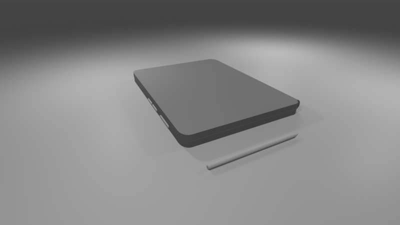

The Dynabook App is the main user application of the Dynabook
device. It is through this app that teachers and students interact the
most. Its features are interconnected to maximize user comfort and to
save time. It anticipates the needs of the teacher or student
according to their
location and time of use, at home, school, in which class, and with
which collaborators.

The educational documents are based on hand annotated pdf documents
(with a stylus) and interactive presentation objects, or Morphs, which are 
plugged in when needed. These teaching 
documents are organized in topics and binders. The plugged Morphs are
retrieved from existing libraries or user written in the Smalltalk
Programming Language.  The administrative contents are organized in objects
described in the Objects chapter, Administrative section. The
educational topic objects are described in the Educational and Document
sections.

## Collaboration

The domain of development is vast, both in software and hardware
designs. To develop the project, we want to encourage world wide
collaborations with private and public institutions, educational
institutions, not limited to, in business, design, pedagogy, hardware,
management, software.

To do this requires a common understanding of the structure and design
of the DynaBook software ecosystem.

# Educator Objects

Educator Objects describe the objects involved in the user activities and their
relations. They are necessary to adapt to the activities the user
(learner or educator) needs to conduct.

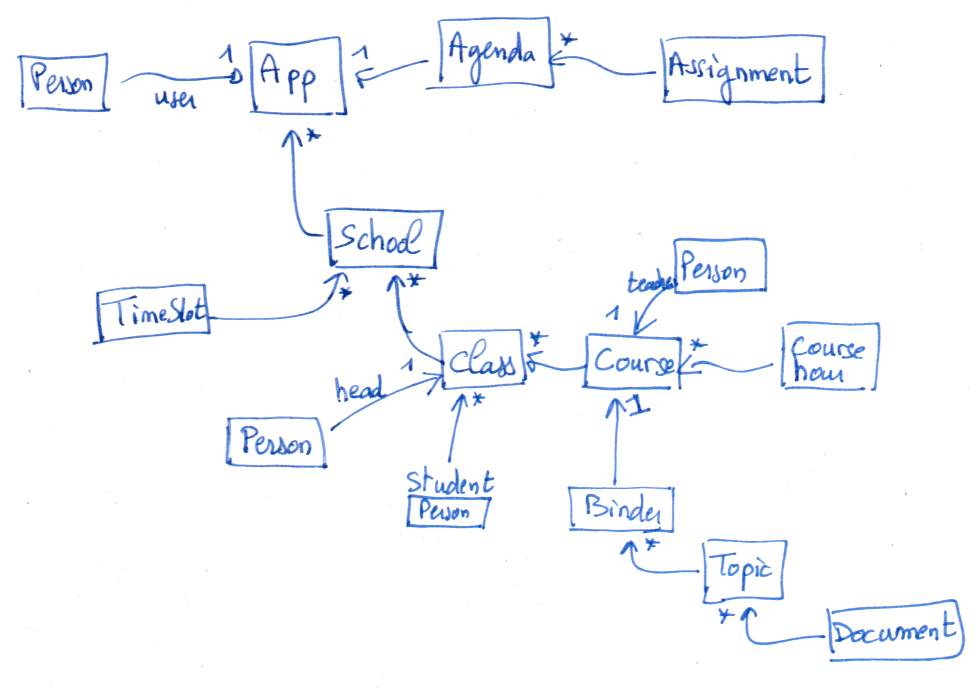

## Administrator Objects

These are the objects describing the educational management, not the
educational content; the administrative facets of the teacher and
student roles.

**App**

* user (Person)
* schools (1st school of the collection is the default one if required)
* agenda

**School**

Description of the user's educational institutions. Possibly several
per user.

* school name
* others, free field
* time slots
* classes

There is a default school establishment per user application, the 1st
one in the schools’ App collection attribute. Put together the courses
collection of the schools defines the schedule of the user (teacher or
student).

**Time slot**

Describe the organization of the teaching periods in a school. A
description per establishment is possible or for all of the user's
establishments when they share the same hourly organization. There are
generally 10 time slots (Geneva).

* name of the period (P1, P2, or H1, H2, etc.)
* start time
* end time

**Course hour**

Describes one or more contiguous teaching periods.

* room
* day of the week
* time slots

**Course**

It is useful for the teacher and student to describe all of their
courses.

* subject (the taught subject name)
* distinctive attributes (color or other)
* teacher (person type), relevant for student user only
* course hours
* binder

**ClassGroup**

It describes a class: list of students, taught courses.

* class number
* head teacher(s) (person(s))
* students (persons)
* courses

**Person**

In the Person hierarchy:

* last name
* first names
* email address

There are two types of people in this hierarchy, teacher and student.

**Teacher**

Described in the school instances

**Student**

Described in the school instances

## Calendar

**Schedule**

Informs about the schedule of the teacher or student. The schedule is
automatically established from the Courses data. It is therefore not a
set of data but an object capable of extracting this schedule
information. It provides an interface to respond to queries like "What
are the next periods of this course?"

**Agenda**

The place to record teacher assignments (tasks. It follows the user
times slots as:

* start date of the school year
* end date
* days off, a collection of Timespan
* tasks (homework)

**Task**

Describe a task (homework) for a given course, the related course is
determined given the time slot and date.

* date
* time slot
* document

## Educational

These objects describe where and how the educational contents are
organized.

**Binder**

**Likely the Binder object is not necessary. Its attribuetd could added as attributes to the Course class.**

A binder contains the educational materials related to a given course. 

* last (the last edited document)
* resources (collection of associated resources as textbook and workbook)
* topics

**Topic**

* title
* documents

# Knowledge Objects

How can the educator represent, describe and modelise knowledge? How
can he/she share the represented knowledge with the learner? How can he/she
assess the learner's knowledge?

How can the learner experiment and capture knowledge? How can she
share her understanding with others? How can he/she...

## Documents

The content of the Dynabook is organized in interactive document
objects.

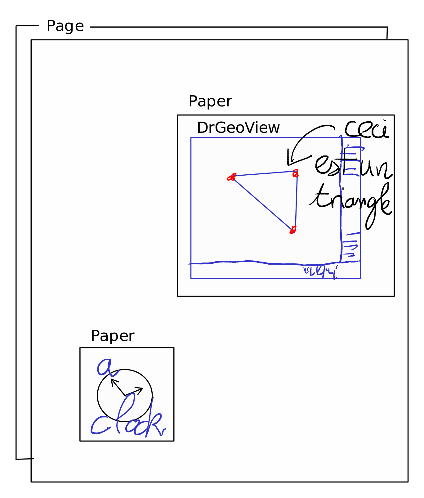

**Document**

It is the root of a tree of Morphs. In a document, diversified Morphs
can be inserted including Dynamic Media described with Smalltalk
code. The document is organized in disjoint pages.

**Page**

This Morph is a unit of a Document, this is the main place for
handwriting. It is constituted of two layers :

* A background morph and a paper (morph) of an extent identical to the
page it is attached too. Examples of background morph are plain color,
calculated (grid, writing lines, music scope, etc), external resources
as a PDF document or still picture.

* A paper morph, it contains the user handwriting.

A page can invoke the document toolbar to operate on it: pen, marker, eraser,
color and dedicated tools for handwriting operations.

Additionally, in a page, the user can insert a kind of PlacedMorph (a
Morph with a location), a view decorated with its own paper Morph, to
retain contextualized and attached handwritten annotations.

**Paper**

An object for handwriting. Each hand strokes between a pen down and a
pen up actions are recorded as strokes collected in a stroke group. The
paper morph contains all these stroke group morphs. Each group
contains individual stroke morphs, which are Bézier curves.

A paper morph can decorate a target Morph (DrGeoView, etc.) to attach
user handwriting. Ideally a sub-morph of the target Morph should also
be attached to user handwriting.

The target morph and the hand strokes
are both attached to the paper morph object which itself is attached
to a page.

Below, samples of preliminary works on the paper morph handwriting:

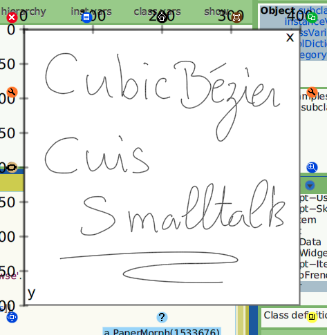

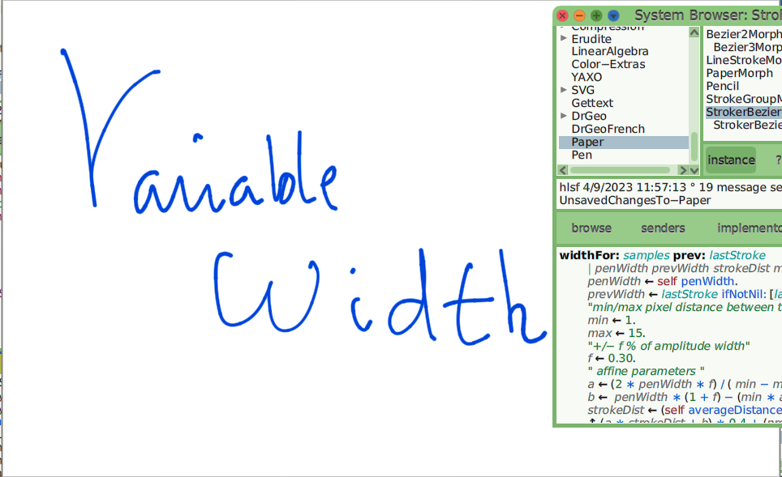

https://mamot.fr/system/media_attachments/files/110/129/414/451/277/255/original/c675cb84990e1108.mp4

## Storage

The storage on disk is organized in folders, sub-folders and
objects. For fast iterations objects are saved as ReferenceStream
and/or SmartReferenceStream. A more durable file format could be
decided later once the overall model stabilizes (Sqlite, XML,etc).

# GUI Layout

Describe GUI layouts and flows between the different parts of the
Dynabook app.

## Home Page

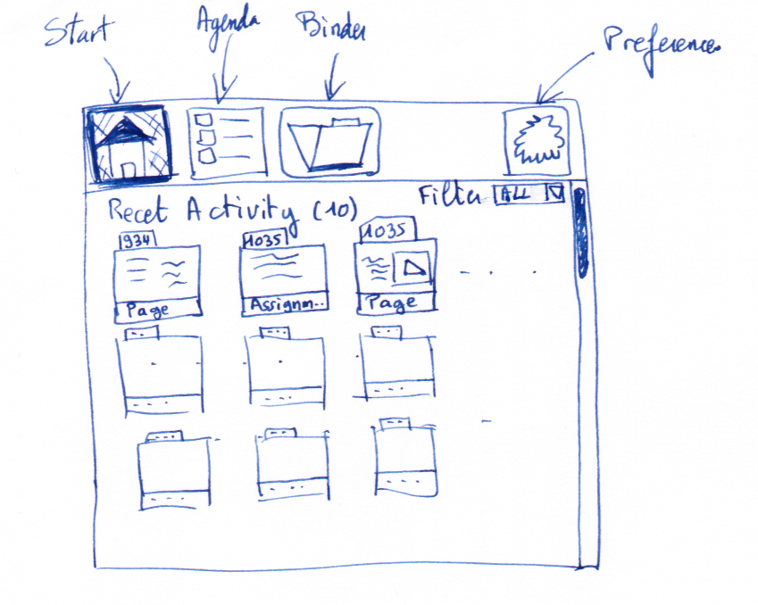

The **home page** always shows a list of recent activities. There are
the edited documents and the tasks. These items are sorted according
to the time of edition of the documents and the due date of the
tasks. Various **Filters** can be applied to narrow the list or to
sort differently.

A click on an item opens the document or the task page. The top bar
and its buttons Start, Agenda, Binder and Preferences are always
visible all along the workflow in the Dynabook app.

## Task Page

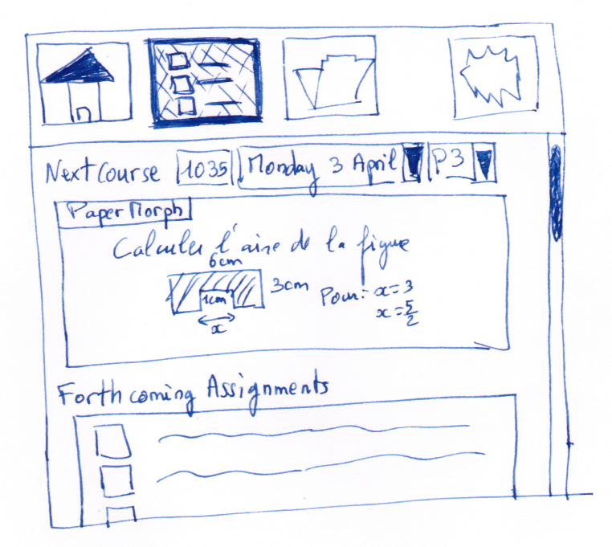

In the task page, the user quickly adds a task for the next
course. The Dynabook tries to guess the class, the day and the period
according to the current date and time. If Dynabook guessing is wrong,
it can be adjusted from the drop down lists.

The task can be handwritten, so the user can easily draw some
sketches.  On the bottom a list of the forthcoming tasks the user can
open for further details. A click on the Task button returns to the
previous task page.

## Binder

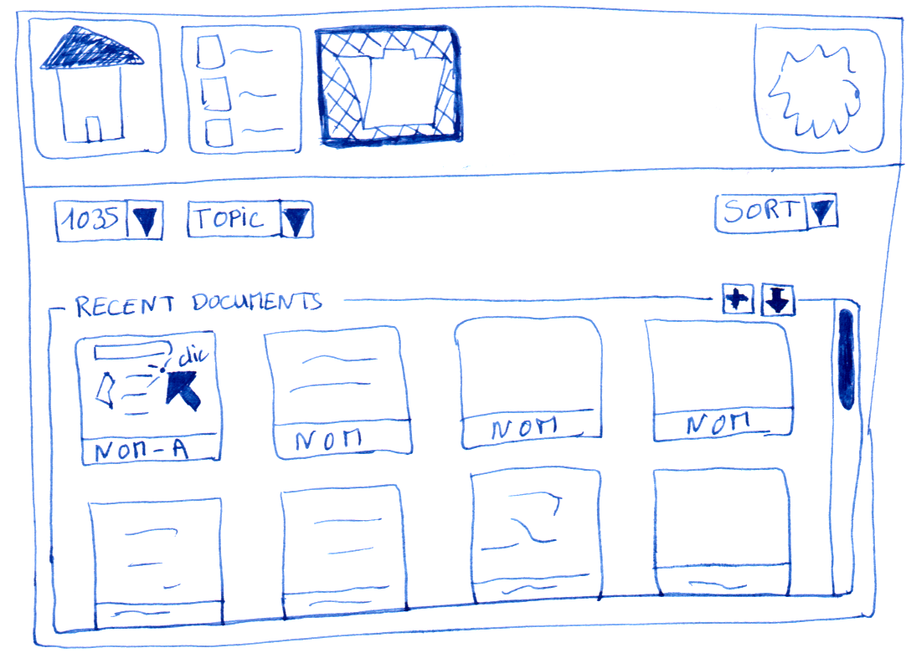

From the binder view, the user finds the class groups, then in each
one its related courses.  For each association of class group/course,
there is a binder object.

The course's binder content (documents) is organized in topics, freely
labeled. Examples of topics can represent groups of contents as
‘Theory’, ‘Exercises’, ‘Evaluation’ or taught topic as ‘Decimal
number’, ‘Triangle geometry’, ‘Pythagore’. Topics are a flat list of
label.

Regarding the organization in the OS, a class group (1035 in the
sketch) is a folder in the file system. A course is also a folder in
its parent class group folder.  Then, a topic is a folder in its
parent course folder. In a topic folder, each file represent a
document.

Therefore, the binder of a class group/course association is
represented as a collection of folders (class group, course, topics)
and files (documents).

The Dynabook tries to guess the appropriate class group, courses and
 topic to present to the user when the binder is opened. The guess is
 based on the current time of the day, the user schedule and the last
 edited documents. If the guess is not appropriate, the user can
 adjust the class group, course and topic from the dropdown lists.

Below a mini view list from the recent documents in the selected class
group and topic is presented. A click in one of these mini views opens
the document editor. From the ‘Recent Documents’ panel, the user can
create a new document and import a pdf document. In the sketch, the
courses drop down menu is missing.

## Document Editor

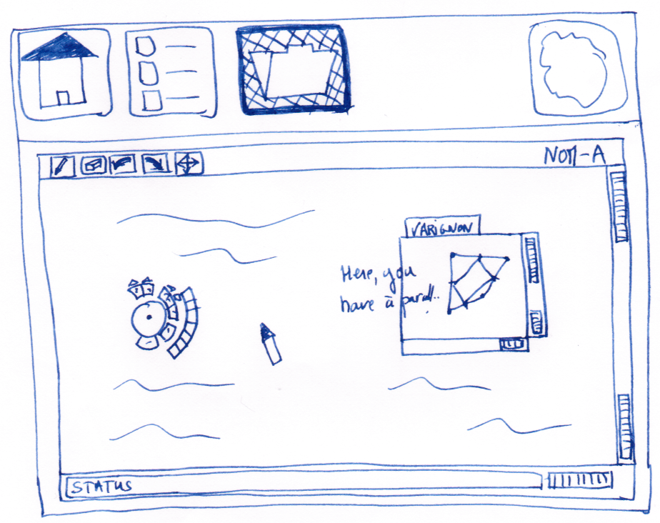

In the document editor, the user can annotate imported PDF
documents. On the top of its view, a horizontal toolbar gives access
to the essential tools : pen, eraser, undo/redo operation and move
action. At the right and the bottom of the view, there are wheel
widgets to zoom in/out and to move in the ox and oy directions of the
document. At the bottom, a horizontal status bar gives information on
the current user tool and status.

Additional tools are invoked from the contextual circular toolbar and
its circular sub-toolbars.

## Preferences Editor

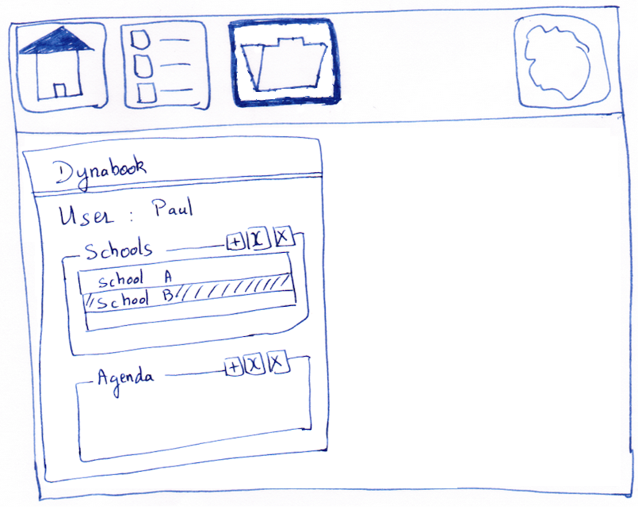

In the preference editor, the user browses in the administrative data
necessary to the application, to meaningfully present the information
to its user.

The user navigates the data with breadcrumbs starting with the top
level ‘Dynabook’ object. From there she navigates the interdependent
objects presented in panels with editable fields for single instance
objects and decorated panels for collection of instances. The
educational documents associated with these objects are discarded by
the Preference editor.

Selecting the ‘Paul’ user presents its information, there is a ‘Save’
button to save editing of the three text fields. In the ‘Classes’
decorated panel, selecting ‘1035’, then the ‘edit’ quick button (the
second one) leads to the ‘1035’ object. Then the navigation can
continue to the ‘Mathematic’ course and so on.

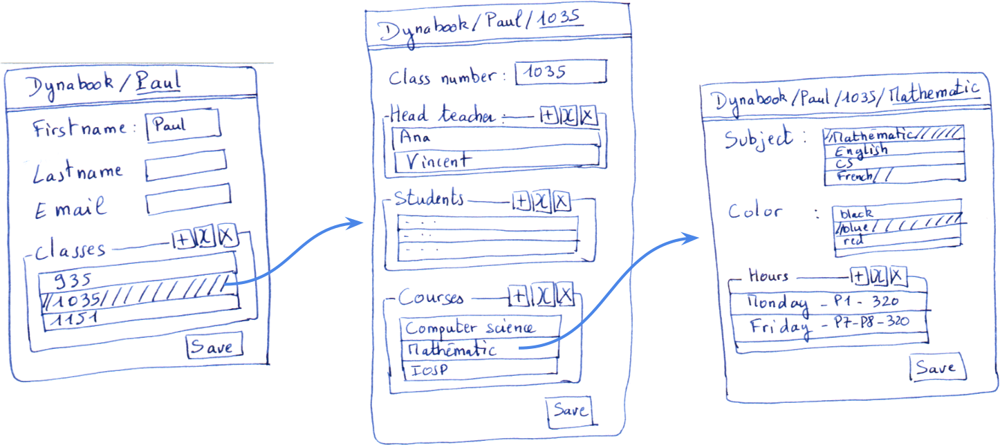

# UI Development

## Widgets

A set of widgets to develop.

**DecoratedPluggableMorph**

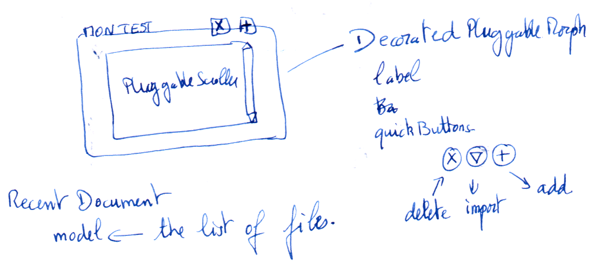

This widget, a sort of **decorated panel**, presents content
surrounded with a line, titled with a label and an optional collection
of quick action buttons.

It is a kind of PluggableMorph, therefore with a **model**. Its
additional attributes are **label** (a Text object) and
**quickButtons**, a collection of buttons. Should the button aspect be
defined in this class is still subject to consideration. Nevertheless
the height of the buttons should be normalized and fixed depending on
the label height.

The label informs the user about the presented contents, the quick
buttons perform actions on the model. Possible actions are creating
and importing content.

Examples of use cases are the ‘Recent Documents’, ‘Recent Activities’
and ‘Forthcoming Tasks’ views presented in the previous sketches.

Other use cases is to view and edit a collection of objects of the
same nature. For example editing the collection of time slots or
subjects in a School instance. The scroller shows a list of selectable
time slots and the quick buttons present the ‘add’, ‘edit’ and
‘delete’ operations on the collections and its items.

**PreviewMorph**

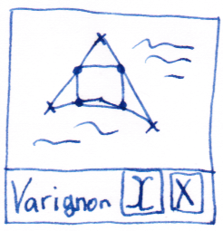

This morph presents the preview of a file on disk. The name of the
file is presented at its button with an optional collection of quick
action buttons.

It is a kind of ImageMorph, it comes with an **image** attribute
(instance of Form) and supplementary attributes **file** and
**selection**. It triggers the events **#selected** and
**#doubleClicked** when it is selected and double-clicked. Actions
related to the quick buttons are handled at the level of the object
instantiating the preview morphs.

**Breadcrumbs**

A widget with a main view in its bottom and top navigation bar. It is
used to browse the administrative objects, both for viewing and to
edition. Below, at the left a view of a school object, at the right
its edition.

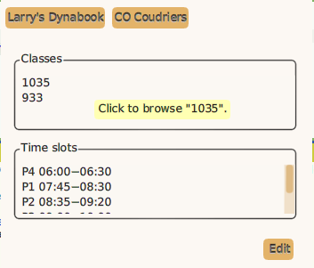

# Hardware

## Concept

# Annexes

## A1. Development schedule

A mere schedule to develop and to test iteratively. It is in
chronological order, however the points overlap.

* Develop the Dynabook app
* Test Dynabook app in school and iterate with the development (1 or 2
  users)
* Develop hardware prototype with existing hardware
* Develop Dynabook operating system
* Test Dynabook app in school and iterate with the development (tenth
  of users)
* Test Dynabook in school and iterate on the hardware and software (1
  or 2 users)
* Test Dynabook hardware and software with one classroom (30 users,
  students and teachers)

## A2. People to contact

* Caula, David (imppao), graphisme
* Dickey, Ken (ken.dickey@whidbey.com), Smalltalker
* Goldberg, Adele (), Smalltalk author, educator
* Lup Yuen Lee, (@lupyuen@qoto.org), Pine phone hardware
* MNT Research, CEO (@mntmn@mastodon.social), open hardware laptop
* Oberson, Paul, SEM prospective
* Pettiaux, Nicolas (@npettiaux@mamot.fr), advocacy
* Vuletich, Juan (juan@cuis.st), Cuis-Smalltalk architect
